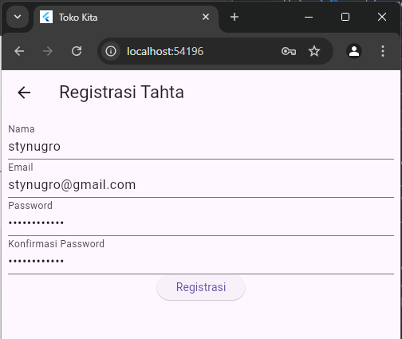
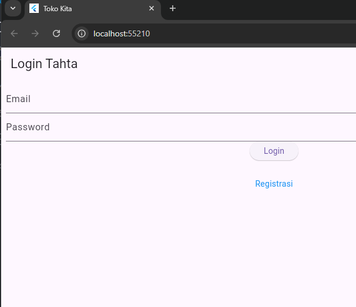
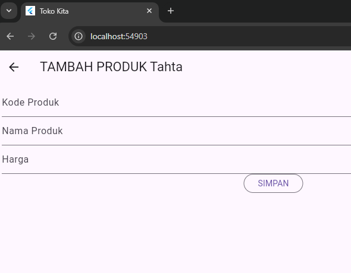
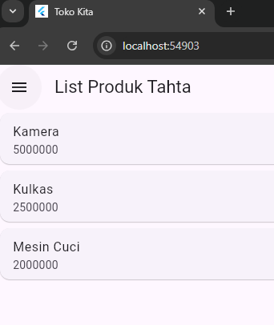
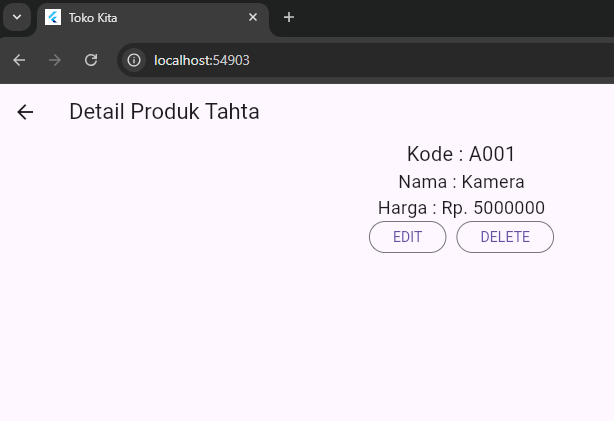

# Tugas Pertemuan 5

**Nama**  : Tahta Setyo Nugroho  
**NIM**   : H1D022066  
**Shift** : E  

## Tampilan Registrasi Page
Sebelum melakukan login, pengguna harus melakukan registrasi terlebih dahulu. Tampilan registrasi di bawah ini diperoleh dari kode di bawah gambar.



```dart
Widget build(BuildContext context) {
    return Scaffold(
      appBar: AppBar(
        title: const Text("Registrasi TAHTA"),
      ),
      body: SingleChildScrollView(
        child: Padding(
          padding: const EdgeInsets.all(8.0),
          child: Form(
            key: _formKey,
            child: Column(
              mainAxisAlignment: MainAxisAlignment.center,
              children: [
                _namaTextField(),
                _emailTextField(),
                _passwordTextField(),
                _passwordKonfirmasiTextField(),
                _buttonRegistrasi()
              ],
            ),
          ),
        ),
      ),
    );
  }
```
## Tampilan Halaman Registrasi Ketika Sudah Berhasil


Alert berhasil tersebut di dapatkan dari kode di bawah ini
```dart
RegistrasiBloc.registrasi(
  nama: _namaTextboxController.text,
  email: _emailTextboxController.text,
  password: _passwordTextboxController.text
).then((value) {
  showDialog(
    context: context,
    barrierDismissible: false,
    builder: (BuildContext context) => SuccessDialog(
      description: "Registrasi berhasil, silahkan login",
      okClick: () {
        Navigator.pop(context);
      },
    )
  );
});
```
## Tampilan Login Page




Setelah berhasil melakukan registrasi pengguna di arahkan menuju ke login page. Tampilan login tersebut berasal dari kode di bawah ini
```dart
 Widget build(BuildContext context) {
    return Scaffold(
      appBar: AppBar(
        title: const Text('Login TAHTA'),
      ),
      body: SingleChildScrollView(
        child: Padding(
          padding: const EdgeInsets.all(8.0),
          child: Form(
            key: _formKey,
            child: Column(
              children: [
                _emailTextField(),
                _passwordTextField(),
                _buttonLogin(),
                const SizedBox(
                  height: 30,
                ),
                _menuRegistrasi()
              ],
            ),
          ),
        ),
      ),
    );
  }
```


Jika pengguna salah mencantumkan email/password maka akan muncul alert seperti ini. Alert tersebut di dapatkan dari kode di bawah ini
```dart
else {
        showDialog(
            context: context,
            barrierDismissible: false,
            builder: (BuildContext context) => const WarningDialog(
                  description: "Login gagal, silahkan coba lagi",
                ));
      }
    }, onError: (error) {
      print(error);
      showDialog(
          context: context,
          barrierDismissible: false,
          builder: (BuildContext context) => const WarningDialog(
                description: "Login gagal, silahkan coba lagi",
              ));
    });
  }
```
## Tampilan Produk Page


Ketika pengguna sudah berhasil login langsung di arahkan ke halaman utama yaitu produk page. 
Gambar diatas menunjukkan halaman yang masih kosong. Untuk menambahkan list produk bisa klik tanda + di kanan atas. berikut kode nya
```dart
actions: [
          Padding(
              padding: const EdgeInsets.only(right: 20.0),
              child: GestureDetector(
                child: const Icon(Icons.add, size: 26.0),
                onTap: () async {
                  Navigator.push(context,
                      MaterialPageRoute(builder: (context) => ProdukForm()));
                },
              ))
        ],
```
## Tampilan Tambah Produk




Pengguna diminta untuk mengisi form produk setelah klik tanda + pada halaman sebelumnya. 
Lalu setelah semua data terisi pengguna diperintahkan untuk klik tombol simpan agar data produk dapat ditampilkan di halaman Produk Page.
Kode tambah produk bisa diliat di bawah ini
```dart
class _ProdukFormState extends State<ProdukForm> {
  final _formKey = GlobalKey<FormState>();
  bool _isLoading = false;
  String judul = "TAMBAH PRODUK TAHTA";
  String tombolSubmit = "SIMPAN";

  final _kodeProdukTextboxController = TextEditingController();
  final _namaProdukTextboxController = TextEditingController();
  final _hargaProdukTextboxController = TextEditingController();

  @override
  void initState() {
    super.initState();
    isUpdate();
  }
  simpan() {
    setState(() {
      _isLoading = true;
    });
    Produk createProduk = Produk(id: null);
    createProduk.kodeProduk = _kodeProdukTextboxController.text;
    createProduk.namaProduk = _namaProdukTextboxController.text;
    // createProduk.hargaProduk = int.parse(_hargaProdukTextboxController.text);
    createProduk.hargaProduk =
        int.tryParse(_hargaProdukTextboxController.text) ?? 0;

    ProdukBloc.addProduk(produk: createProduk).then((value) {
      Navigator.of(context).push(MaterialPageRoute(
          builder: (BuildContext context) => const ProdukPage()));
    }, onError: (error) {
      showDialog(
          context: context,
          builder: (BuildContext context) => const WarningDialog(
                description: "Simpan gagal, silahkan coba lagi",
              ));
    });
    setState(() {
      _isLoading = false;
    });
  }}
```
# Tampilan Produk Page (Ketika Sudah Ada Isinya)




Setelah pengguna menekan tombol simpan maka datanya akan muncul di produk page.
Tampian tersebut di dapatkan dari kode di bawah ini
```dart
  body: FutureBuilder<List>(
        future: ProdukBloc.getProduks(),
        builder: (context, snapshot) {
          if (snapshot.hasError) print(snapshot.error);
          return snapshot.hasData
              ? ListProduk(
                  list: snapshot.data,
                )
              : const Center(
                  child: CircularProgressIndicator(),
                );
        },
      ),
    );
  }
}

class ListProduk extends StatelessWidget {
  final List? list;
  const ListProduk({Key? key, this.list}) : super(key: key);
  @override
  Widget build(BuildContext context) {
    return ListView.builder(
        itemCount: list == null ? 0 : list!.length,
        itemBuilder: (context, i) {
          return ItemProduk(
            produk: list![i],
          );
        });
  }
}

class ItemProduk extends StatelessWidget {
  final Produk produk;
  const ItemProduk({Key? key, required this.produk}) : super(key: key);
  @override
  Widget build(BuildContext context) {
    return GestureDetector(
      onTap: () {
        Navigator.push(
            context,
            MaterialPageRoute(
                builder: (context) => ProdukDetail(
                      produk: produk,
                    )));
      },
      child: Card(
        child: ListTile(
          title: Text(produk.namaProduk!),
          subtitle: Text(produk.hargaProduk.toString()),
        ),
      ),
    );
  }
}
```
## Tampilan Detail Produk




Ketika pengguna menekan produknya maka rincian dari produk tersebut akan ditampilkan. Tampilan tersebut berasal dari kode di bawah ini 
```dart
Widget build(BuildContext context) {
    return Scaffold(
      appBar: AppBar(
        title: const Text('Detail Produk Tahta'),
      ),
      body: Center(
        child: Column(
          children: [
            Text(
              "Kode : ${widget.produk!.kodeProduk}",
              style: const TextStyle(fontSize: 20.0),
            ),
            Text(
              "Nama : ${widget.produk!.namaProduk}",
              style: const TextStyle(fontSize: 18.0),
            ),
            Text(
              "Harga : Rp. ${widget.produk!.hargaProduk.toString()}",
              style: const TextStyle(fontSize: 18.0),
            ),
            _tombolHapusEdit()
          ],
        ),
      ),
    );
  }
```
 ## Tampilan Edit Produk


Ketika pengguna menekan tombol edit pada tampilan sebelumnya, maka produk tersebut dapat di edit sesuai kemauan kita. Kodenya ada di bawah ini
```dart
// TOMBOL EDIT
 Widget _tombolHapusEdit() {
    return Row(
      mainAxisSize: MainAxisSize.min,
      children: [
        //Tombol Edit
        OutlinedButton(
            child: const Text("EDIT"),
            onPressed: () {
              Navigator.push(
                  context,
                  MaterialPageRoute(
                      builder: (context) => ProdukForm(
                            produk: widget.produk!,
                          )));
            }),

// FORM
Widget build(BuildContext context) {
    return Scaffold(
      appBar: AppBar(title: Text(judul)),
      body: SingleChildScrollView(
        child: Padding(
          padding: const EdgeInsets.all(8.0),
          child: Form(
            key: _formKey,
            child: Column(
              children: [
                _kodeProdukTextField(),
                _namaProdukTextField(),
                _hargaProdukTextField(),
                _buttonSubmit()
              ],
            ),
          ),
        ),
      ),
    );
  }

// BUTTON UBAH
 Widget _buttonSubmit() {
    return OutlinedButton(
        child: Text(tombolSubmit),
        onPressed: () {
          var validate = _formKey.currentState!.validate();
          if (validate) {
            if (!_isLoading) {
              if (widget.produk != null) {
                //kondisi update produk
                ubah();
              }
```
## Tampilan Hapus Produk


Namun ketika pengguna menekan tombol hapus maka akan muncul alert yang jika di klik Ya maka produk tersebut akan hilang dari List Produk.
Kode dapat di lihat di bawah ini
```dart
 void confirmHapus() {
    AlertDialog alertDialog = AlertDialog(
      content: const Text("Yakin ingin menghapus data ini?"),
      actions: [
//tombol hapus
        OutlinedButton(
          child: const Text("Ya"),
          onPressed: () {
            ProdukBloc.deleteProduk(id: int.parse(widget.produk!.id!)).then(
                (value) => {
                      Navigator.of(context).push(MaterialPageRoute(
                          builder: (context) => const ProdukPage()))
                    }, onError: (error) {
              showDialog(
                  context: context,
                  builder: (BuildContext context) => const WarningDialog(
                        description: "Hapus gagal, silahkan coba lagi",
                      ));
            });
          },
        ),
//tombol batal
        OutlinedButton(
          child: const Text("Batal"),
          onPressed: () => Navigator.pop(context),
        )
      ],
    );
    showDialog(builder: (context) => alertDialog, context: context);
  }
}
```
## Tampilan Logout Page


Untuk menjangkau tombol logout, pengguna harus menekan garis tiga yang ada di pojok kiri atas. 
Ketika pengguna menekan tombol logout maka tampilan langsung kembali ke Login Page. Kode tersebut ada di bawah ini
```dart
children: [
            ListTile(
              title: const Text('Logout'),
              trailing: const Icon(Icons.logout),
              onTap: () async {
                await LogoutBloc.logout().then((value) => {
                      Navigator.of(context).pushAndRemoveUntil(
                          MaterialPageRoute(builder: (context) => LoginPage()),
                          (route) => false)
                    });
              },
            )
          ],
```
